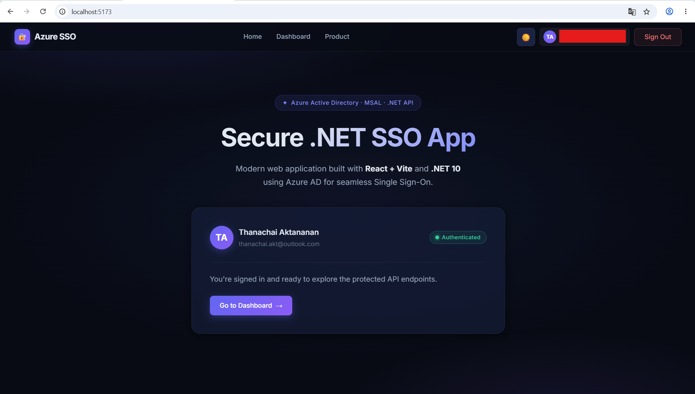
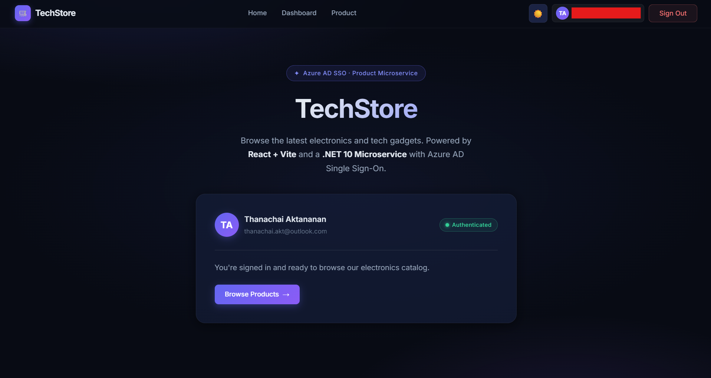
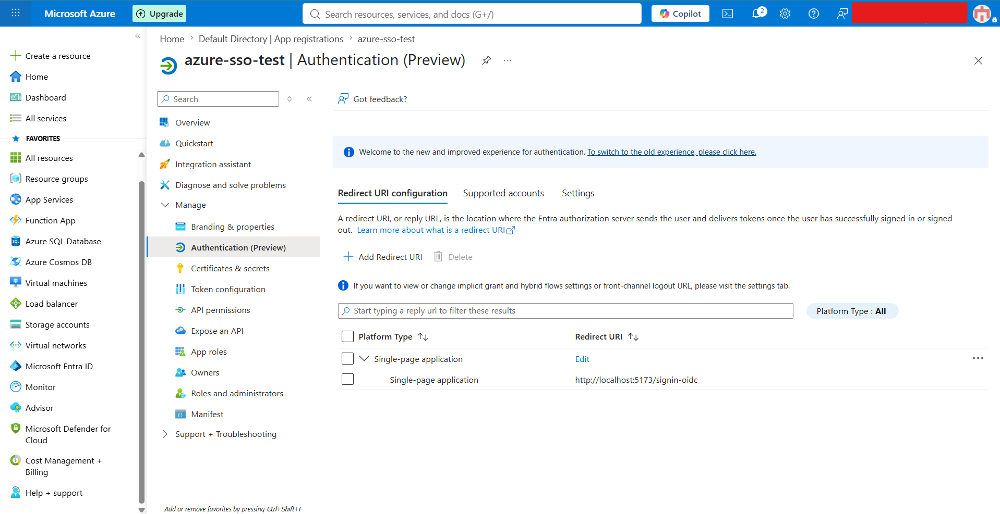
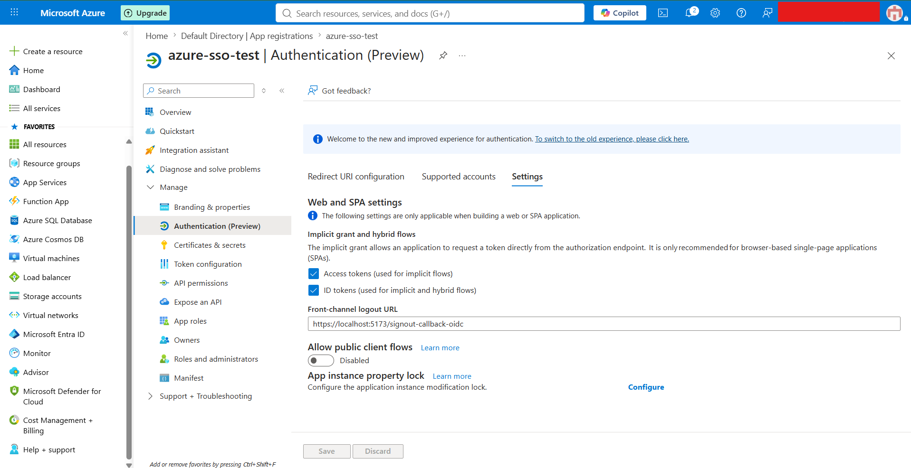

# คู่มือการตั้งค่าและการรันระบบ (Setup & Running Guide)

คู่มือนี้แนะนำวิธีการตั้งค่าสภาพแวดล้อม (Environment Variables), โครงสร้างโปรเจกต์ และขั้นตอนการรันบริการทั้งหมดในระบบ โดยแบ่งออกเป็น **Frontend Client (React/Vite)** และ **Backend API (.NET Core)**




---

## 📁 โครงสร้างโปรเจกต์ (Project Structure)
```text
dotnet-azure-ad-sso/
├── api/                           # Backend APIs (.NET)
│   └── src/
│       ├── authentication/         # Authentication API (Port 5000/5001)
│       └── product/                # Product API (Port 5001/7001)
├── client/                        # Main Frontend folder (npm workspaces)
│   ├── auth/                      # Authentication/Main Client application (Port 5173)
│   ├── product/                   # Product Client application (Port 5174)
│   ├── shared/                    # Shared UI Components library
│   ├── package.json               # Configuration for npm workspaces
│   ├── package-lock.json
│   └── .gitignore
└── README.md                      # ไฟล์คู่มือนี้
```

---

## ⚙️ การตั้งค่าสภาพแวดล้อม (Environment Configuration)

ก่อนเริ่มรันบริการต่าง ๆ ให้คัดลอกไฟล์ตัวอย่างและใส่ค่าคอนฟิกให้ถูกต้อง **(ห้ามนำรหัสผ่านหรือคีย์สำคัญจริงเก็บไว้ใน Git)**

### 1. Client App (client/auth/)
สร้างไฟล์ `client/auth/.env` จากต้นแบบ `client/auth/.env-example`:
```bash
VITE_APP_CLIENT_ID=<YOUR_AZURE_AD_CLIENT_ID>
VITE_APP_TENANT_ID=<YOUR_AZURE_AD_TENANT_ID>
VITE_APP_REDIRECT_URI=http://localhost:5173/signin-oidc
VITE_APP_POST_LOGOUT_REDIRECT_URI=http://localhost:5173/logged-out
VITE_APP_API_ENDPOINT=http://localhost:5000
```

### 2. Product Client App (client/product/)
สร้างไฟล์ `client/product/.env` จากต้นแบบ `client/product/.env-example`:
```bash
VITE_APP_CLIENT_ID=<YOUR_AZURE_AD_CLIENT_ID>
VITE_APP_TENANT_ID=<YOUR_AZURE_AD_TENANT_ID>
VITE_APP_REDIRECT_URI=http://localhost:5174/signin-oidc
VITE_APP_POST_LOGOUT_REDIRECT_URI=http://localhost:5174/logged-out
VITE_APP_PRODUCT_API_ENDPOINT=http://localhost:5001
```

### 3. Authentication API (api/src/authentication/)
สร้างไฟล์ `api/src/authentication/appsettings.json` จากต้นแบบ `appsettings-example.json`:
```json
{
  "Logging": {
    "LogLevel": {
      "Default": "Information",
      "Microsoft.AspNetCore": "Warning"
    }
  },
  "AllowedHosts": "*",
  "AzureAd": {
    "Instance": "https://login.microsoftonline.com/",
    "TenantId": "<YOUR_AZURE_AD_TENANT_ID>",
    "ClientId": "<YOUR_AZURE_AD_CLIENT_ID>",
    "ClientCertificates": [
      {
        "SourceType": "StoreWithThumbprint",
        "CertificateStorePath": "CurrentUser/My",
        "CertificateThumbprint": "<YOUR_CERTIFICATE_THUMBPRINT>"
      }   
    ],
    "CallbackPath": "/signin-oidc",
    "SignedOutCallbackPath": "/signout-callback-oidc",
    "KnownAuthorities": ["login.contoso.com"]
  },
  "DownstreamApi": {
    "BaseUrl": "https://graph.microsoft.com/v1.0/",
    "RelativePath": "me",
    "Scopes": [ 
      "user.read" 
    ]
  }
}
```

### 4. Product API (api/src/product/)
สร้างไฟล์ `api/src/product/appsettings.json` จากต้นแบบ `appsettings-example.json`:
```json
{
  "Logging": {
    "LogLevel": {
      "Default": "Information",
      "Microsoft.AspNetCore": "Warning"
    }
  },
  "AllowedHosts": "*",
  "AzureAd": {
    "Instance": "https://login.microsoftonline.com/",
    "TenantId": "<YOUR_AZURE_AD_TENANT_ID>",
    "ClientId": "<YOUR_AZURE_AD_CLIENT_ID>",
    "Audience": "<YOUR_AZURE_AD_CLIENT_ID>"
  }
}
```

---

## 🚀 ขั้นตอนการติดตั้งและรันระบบ (Installation & Run Guide)

### 1. ติดตั้ง Dependencies สำหรับ Frontend (npm workspaces)
เนื่องจากระบบใช้ npm workspaces จัดการ frontend projects ให้เรียกใช้คำสั่งติดตั้งที่โฟลเดอร์ client/ ของโปรเจกต์:
```bash
# สลับไปยังโฟลเดอร์ client และติดตั้ง dependencies ทั้งหมด
cd client
npm install
```

### 2. วิธีการรัน Frontend Client

สามารถเริ่มโปรเจกต์สำหรับ Development Mode ได้สองวิธี:

#### วิธีที่ 1: รันจาก Client Directory ด้วย npm workspace
```bash
cd client

# รัน Main Client (Port 5173)
npm run dev --workspace=auth

# รัน Product Client (Port 5174)
npm run dev --workspace=product
```

#### วิธีที่ 2: เข้าไปรันที่โฟลเดอร์ของแอปโดยตรง
*   **สำหรับ Main Client:**
    ```bash
    cd client/auth
    npm run dev
    ```
*   **สำหรับ Product Client:**
    ```bash
    cd client/product
    npm run dev
    ```

---

### 3. วิธีการรัน Backend API (.NET)

ให้รันโปรเจกต์ .NET ในช่วงการพัฒนา (Development Mode) โดยใช้ CLI หรือ IDE:

#### รัน Authentication API (Port 5000 / 5001)
```bash
cd api/src/authentication
dotnet run
```
หรือรันแบบระบุ Profile จาก `launchSettings.json`:
```bash
dotnet run --launch-profile http
```

#### รัน Product API (Port 5001 / 7001)
```bash
cd api/src/product
dotnet run
```
หรือรันแบบระบุ Profile จาก `launchSettings.json`:
```bash
dotnet run --launch-profile http
```

---

## 🔒 ข้อมูลความปลอดภัย (Security Guidelines)
1. **ห้าม Commit ข้อมูลสำคัญ**: ไฟล์ `.env` และ `appsettings.json` มีการระบุไว้ใน `.gitignore` แล้ว เพื่อความปลอดภัยไม่ควรอัปเดตค่าจริงเข้าสู่ระบบ Git
2. **Azure AD Enterprise App Registration**: ตรวจสอบการตั้งค่า **Redirect URIs** บน Microsoft Entra ID (Azure Portal) ให้สอดคล้องกับค่า Port ที่ใช้จริง (เช่น `http://localhost:5173/signin-oidc` และ `http://localhost:5174/signin-oidc`)
3. **Front-Channel Logout**: ตรวจสอบให้มั่นใจว่าตั้งค่า Front-channel logout URL บน Azure AD เพื่อรองรับ Single Sign-Out ข้ามแอปพลิเคชันอย่างสมบูรณ์

## ตัวอย่างการ setup azure ad



